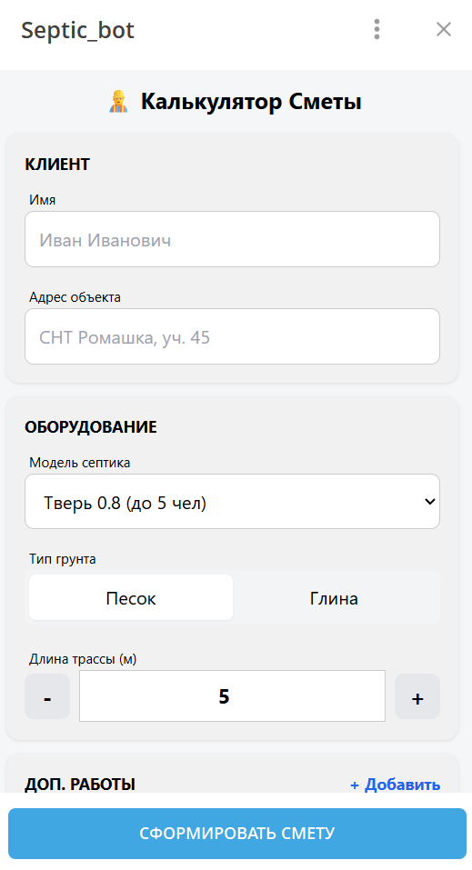

# 🏗️ AI Smart Estimate Bot


**A full-cycle Telegram WebApp for automating construction estimates using AI.**

This project allows construction managers to generate professional PDF estimates and commercial proposals in seconds. It combines a user-friendly **Telegram WebApp interface** with a **DeepSeek AI** backend to parse natural language requests and calculate precise costs based on dynamic pricing.

---

## 📸 Demo



---

## 🚀 Key Features

* **Telegram WebApp Integration:** Seamless UI/UX directly inside Telegram (no external browser needed).
* **AI-Powered Parsing:** Uses **DeepSeek API** to interpret natural language requests (e.g., *"Need a septic tank for 5 people, clay soil, 10m pipe"*).
* **Dynamic PDF Generation:** Automatically creates branded Commercial Proposals (KP) and strict Estimate documents with signatures.
* **Smart Math:** Calculates complex logic (soil types, pipe lengths, diamond drilling costs) automatically.
* **Production Ready:** Deployed using **Systemd**, **Caddy (Reverse Proxy + SSL)**, and **FastAPI**.

---

## 🛠️ Tech Stack

* **Language:** Python 3.10
* **Bot Framework:** Aiogram 3 (AsyncIO)
* **Web Backend:** FastAPI + Uvicorn
* **AI Model:** DeepSeek (OpenAI-compatible API)
* **PDF Engine:** FPDF
* **Infrastructure:** Linux (Ubuntu), Systemd, Caddy Web Server

---

## ⚙️ Installation & Setup

1.  **Clone the repository:**
    ```bash
    git clone [https://github.com/YOUR_USERNAME/septic-bot.git](https://github.com/YOUR_USERNAME/septic-bot.git)
    cd septic-bot
    ```

2.  **Create a virtual environment:**
    ```bash
    python3 -m venv venv
    source venv/bin/activate
    ```

3.  **Install dependencies:**
    ```bash
    pip install -r requirements.txt
    ```

4.  **Set up Environment Variables:**
    Create a `.env` file in the root directory and add your credentials (never commit this file!):
    ```env
    TELEGRAM_TOKEN=your_telegram_bot_token
    AI_API_KEY=your_deepseek_api_key
    ```

5.  **Run the application:**
    ```bash
    python main.py
    ```

---

## 📂 Project Structure

```text
septic-bot/
├── assets/             # Images, fonts, and PDF assets
├── templates/          # HTML templates for the WebApp
├── config.py           # Configuration and keys loader
├── main.py             # Bot entry point
├── webapp.py           # FastAPI backend for WebApp
├── services.py         # Price lists and calculation logic
├── pdf_generator.py    # PDF creation logic
└── .env                # Secrets (not in repo)
